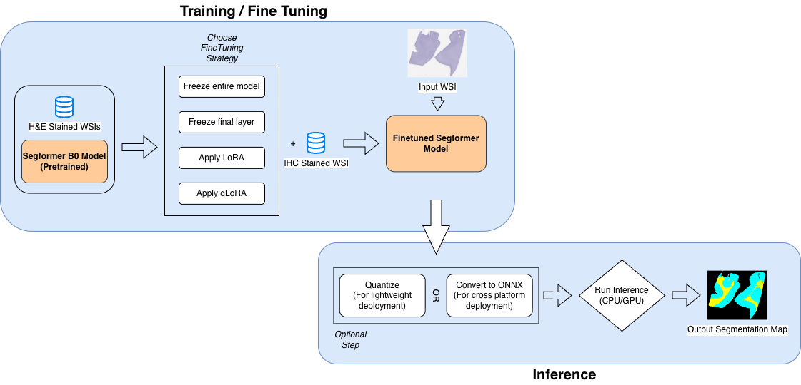

# 🧠 BrainSec2.0 — WSI Segmentation Toolkit

<p align="center">
  
  <br/>
  <em>Figure 1: End-to-End Whole-Slide-Image (WSI) Segmentation Pipeline using SegFormer</em>
</p>

## Overview
**BrainSec2.0** is a transformer-based segmentation toolkit for large-scale *Whole-Slide Images (WSI)* of the human brain. It extends **SegFormer** [(Xie et al., 2021)](https://arxiv.org/abs/2105.15203) with **LoRA / QLoRA fine-tuning**, **quantization**, and **ONNX-based inference** for GPU and CPU environments. The toolkit achieves *research-grade accuracy* while remaining lightweight enough for macOS laptops and low-resource desktops.

## Key Features
| Category | Description |
|-----------|--------------|
| **Segmentation** | White- and gray-matter segmentation on high-resolution WSIs |
| **Fine-Tuning** | Four LoRA / QLoRA configurations for flexible adaptation |
| **Performance** | Full-slide inference in ≈ 3 min (GPU) or ≈ 15 min (CPU / M-series Mac) |
| **Deployment** | Quantized ONNX export for efficient CPU inference |
| **Platform Support** | macOS, Linux, NVIDIA GPUs, and HPC clusters |
| **Ease of Use** | Plug-and-play scripts + reproducible Conda environment |

## ⚡ Quickstart

### Step 1 — Setup Environment
Clone the repository and create the Conda environment:
```bash
git clone https://github.com/<your-username>/brainsec2.0.git
cd brainsec2.0
conda env create -f environment.yml
conda activate brainsec
```

### Step 2 — Download Models
Model weights are large and hosted externally on Google Drive.

```bash
mkdir -p models
unzip ~/Downloads/model.zip -d models/
```

### Step 3 — Run Inference

```bash
python src/inference/inference_main.py
```

```bash
python src/onnxformatting/inference_onnx.py
```