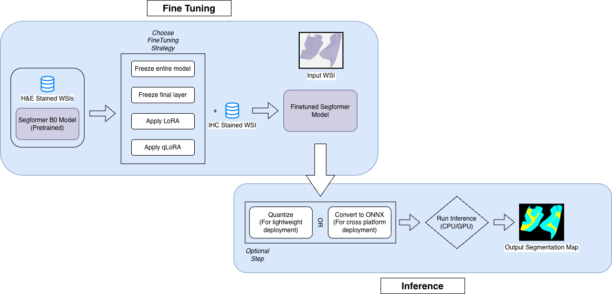

# 🧠 BrainSec2.0 — WSI Segmentation Toolkit

<p align="center">
  
  <br/>
  <em>Figure 1: End-to-End Whole-Slide-Image (WSI) Segmentation Pipeline using SegFormer</em>
</p>

## Overview
**BrainSec2.0** is a transformer-based segmentation toolkit for large-scale *Whole-Slide Images (WSI)* of the human brain. It extends **SegFormer** [(Xie et al., 2021)](https://arxiv.org/abs/2105.15203) with **LoRA / QLoRA fine-tuning**, **quantization**, and **ONNX-based inference** for GPU and CPU environments. The toolkit achieves *research-grade accuracy* while remaining lightweight enough for macOS laptops and low-resource desktops.

## Key Features
| Category | Description |
|-----------|--------------|
| **Segmentation** | White- and gray-matter segmentation on high-resolution WSIs |
| **Fine-Tuning** | Four LoRA / QLoRA configurations for flexible adaptation |
| **Performance** | Full-slide inference in ≈ 3 min (GPU) or ≈ 15 min (CPU / M-series Mac) |
| **Deployment** | Quantized ONNX export for efficient CPU inference |
| **Platform Support** | macOS, Linux, NVIDIA GPUs, and HPC clusters |
| **Ease of Use** | Plug-and-play scripts + reproducible Conda environment |

## Quickstart

### Step 1 — Setup Environment
Clone the repository and create the Conda environment:
```bash
conda env create -f configs/server_env.yml -n brainsec2
conda activate brainsec2
```

### Step 2 — Download Models
Model weights are large and hosted externally on Google Drive at: https://drive.google.com/drive/folders/1NbLP4E-m5RhgTmHj4mcee1ZR6OcevJIm?usp=sharing

More public WSI data available at:
1. https://zenodo.org/records/1470797 (.svs)
2. https://datadryad.org/dataset/doi:10.5061/dryad.7h44j107j (.czi)

```bash
mkdir -p models
unzip ~/Downloads/model.zip -d models/
```

### Step 3 — Run Inference
GPU Inference (≈ 3 min on NVIDIA GPU)
```bash
python src/inference/inference_main.py \
  --model-type pretrained \
  --model-dir models/segformer_pretrained \
  --wsi-path data/sample.svs \
  --output output.png \
  --batch-size 8
```

CPU Inference with ONNX (≈ 15 min on M-series)
```bash
python src/onnxformatting/inference_onnx.py \
  --onnx-model models/segformer_lora.onnx \
  --wsi-path data/sample.svs \
  --output output_onnx.png \
  --executor-provider CPUExecutionProvider
```


## Fine Tuning
Finetune the base segformer model using a strategy
```bash
python src/inference/inference_main.py \
  --model-type lora \
  --model-dir models/ft_models/finetuned_lora \
  --base-model-dir models/segformer_pretrained \
  --wsi-path data/sample.svs
```

## Documentation Report
https://drive.google.com/file/d/17flD9lxXUXJsLXH2l05qet6YfuAPcc4E/view?usp=sharing